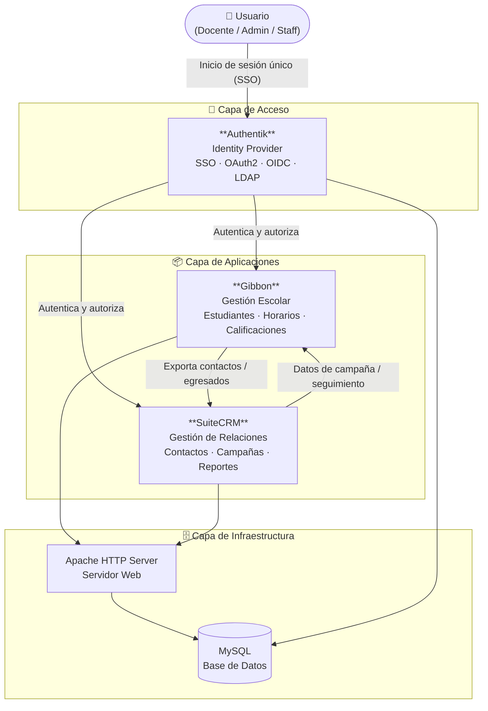

# Diagrama de Ecosistema OSS

Propuesta de arquitectura para una organización educativa utilizando herramientas de código abierto.

---

## Descripción del ecosistema

| Herramienta | Rol en el ecosistema | Arquitectura |
|---|---|---|
| **Authentik** | Proveedor de identidad centralizado. Gestiona el inicio de sesión único (SSO) para todas las aplicaciones. | Modular |
| **Gibbon** | Sistema de gestión escolar. Administra estudiantes, docentes, horarios y calificaciones. | Monolítica |
| **SuiteCRM** | CRM para gestión de relaciones con egresados, donantes y contactos externos. | Monolítica |
| **Apache** | Servidor web que sirve las aplicaciones al navegador. | — |
| **MySQL** | Base de datos compartida por las aplicaciones. | — |

## Flujo principal

1. El usuario accede a cualquier aplicación del ecosistema.
2. **Authentik** intercepta la solicitud y valida la identidad mediante SSO.
3. Una vez autenticado, el usuario accede a **Gibbon** o **SuiteCRM** según su rol.
4. **Gibbon** puede exportar datos de egresados o contactos hacia **SuiteCRM** para campañas de seguimiento.
5. Toda la información persiste en **MySQL** a través del servidor **Apache**.
